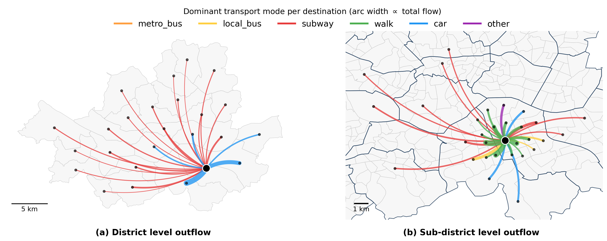

# SeoulMMOD

This is the code repository for SeoulMMOD benchmark experiments. SeoulMMOD
contains hourly multimodal origin-destination flows within Seoul from 2023 to
2025. It covers six urban transport modes at district and subdistrict scales,
with aligned administrative metadata and contextual data.



## OD Flow Schema

| Attribute | Description | Values |
|---|---|---|
| `date` | Calendar date. | `YYYY-MM-DD` |
| `st_hour` | Hour of day. | 0-23 |
| `origin` | Origin subdistrict code. | District-scale datasets use the first five digits |
| `dest` | Destination subdistrict code. | District-scale datasets use the first five digits |
| `mode` | Transport mode code. | 4 metro bus, 5 local bus, 6 subway, 7 walk, 8 car, 9 other |
| `flow` | Estimated OD flow volume. | Nonnegative real number |
| `avg_dist_m` | Average travel distance in meters. | Nonnegative real number |
| `avg_time_min` | Average travel time in minutes. | Nonnegative real number |

## Structure

```text
baselines/       BasicTS baseline configs and model code
basicts/         BasicTS framework code used in the benchmark
datasets/        downloaded data and generated BasicTS datasets
experiments/     training and evaluation scripts
scripts/         data builders and utility scripts
```

## Installation

```bash
pip install -r requirements.txt
```

## Data

Download the released dataset from Kaggle and place its contents under
`datasets/`.

To build BasicTS datasets from the released parquet files:

```bash
python scripts/build_basicts_dataset.py \
  --input-dir datasets/raw \
  --output-dir datasets \
  --level district \
  --years 2024
```

Use `--level subdistrict` for the subdistrict-scale dataset.

Processed datasets are placed under `datasets/`.

```text
datasets/
  SeoulMMOD_District_2024/
  SeoulMMOD_Subdistrict_2024/
```

## Training

```bash
python experiments/train.py \
  -c baselines/STAEformer/SeoulMMOD_District_2024_allmode_h24.py \
  -g 0
```

Use another config under `baselines/` for a different model.

## Context

```bash
python scripts/build_district_context_dataset.py --year 2024
python scripts/build_district_rain_dataset.py --year 2024
```

These scripts use optional files such as `calendar.csv`,
`district_poi.csv`, `district_metadata.csv`, and rainfall CSVs under
`datasets/`.

## Citation

Please cite the original papers for external components used in this repository.

| Component | Source | Paper |
|---|---|---|
| BasicTS | https://github.com/zezhishao/BasicTS | [BasicTS: An Open Source Fair Multivariate Time Series Prediction Benchmark](https://openreview.net/forum?id=vgCXSxW9Mf) |
| MPGCN | https://github.com/underdoc-wang/MPGCN | [Predicting Origin-Destination Flow via Multi-Perspective Graph Convolutional Network](https://dblp.org/rec/conf/icde/ShiYGLZYLL20) |
| ODCRN | https://github.com/deepkashiwa20/ODCRN | [Countrywide Origin-Destination Matrix Prediction and Its Application for COVID-19](https://doi.org/10.1007/978-3-030-86514-6_20) |
| ODMixer | https://github.com/KLatitude/ODMixer | [ODMixer: Fine-Grained Spatial-Temporal MLP for Metro Origin-Destination Prediction](https://arxiv.org/abs/2404.15734) |
